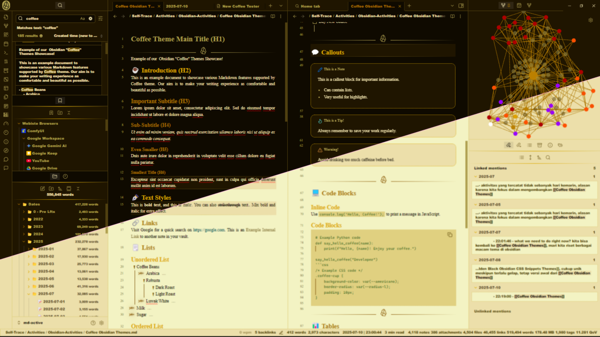
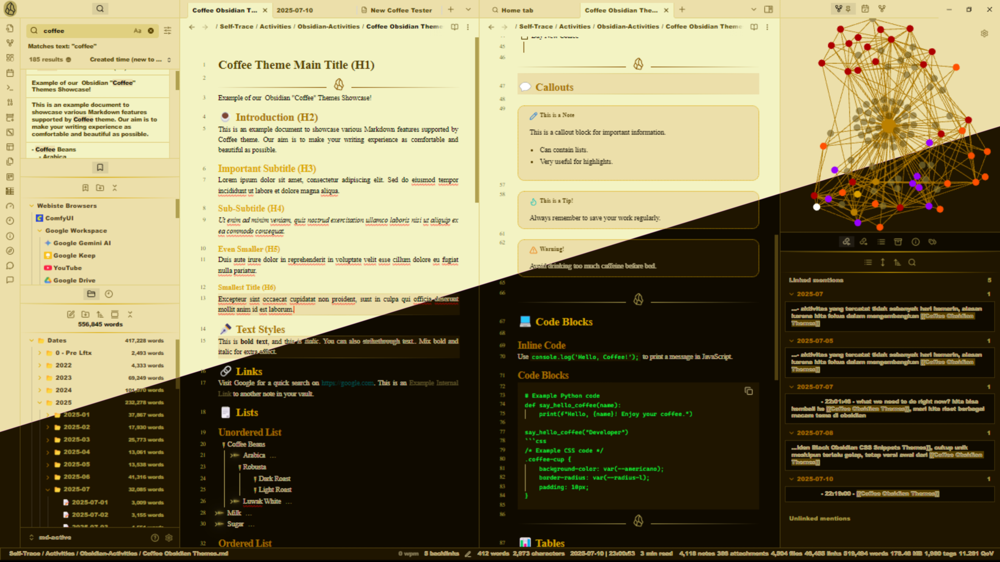

# Coffee Obsidian Theme By @regawaras

## Overview
The "Coffee" theme for Obsidian offers a rich visual experience, bringing the duality of coffee flavors through its dark (Dark Coffee) and light (Light Coffee) modes. This theme is designed to provide an ergonomic, soothing, and warm feel to your eyes, creating a comfortable working environment.

## Screenshots
Here are some screenshots of the theme.

## Dark Themed Coffee 

## Light Themed Coffee

## Key Features
1. coffee-inspired color palette, optimized for both dark & light modes. The light mode specifically crafted for visual comfort with warm undertones. Utilizes CSS variables named after coffee terms (e.g., --americano, --moccacino, --latte, --caramel, --hazelnut) for consistency and ease of customization.

2. Intelligent Highlighting: Features active line and hover line highlighting in the source view for easier navigation. 

3. Professional Print Settings: Includes specific styles for PDF printing, ensuring documents look polished with "Times New Roman" font and justified text. 

4. Dynamic List Display: Adjustments for both bullet points and numbered lists, with animations for collapsed and uncollapsed items. 

5. Obsidian Icon on Horizontal separator line & side dock / side bar.

6. Simple & Easy customizable File Explorer Icons with emoji: folder (📂) and file (📝) icons in the Obsidian file explorer. 

7. Enhanced Text Styling: Custom styles for text highlights, cursor caret, and callout blocks. 

## Installation
1. Open Obsidian.
2. Go to Settings (gear icon in the bottom left).
3. Select Appearance from the sidebar.
4. In the Themes section, click the Manage button next to "Community themes".
5. Search for "Coffee" in the search bar.
6. Click Use to apply the theme.
